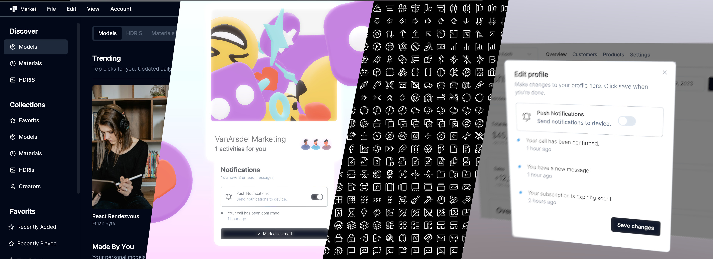
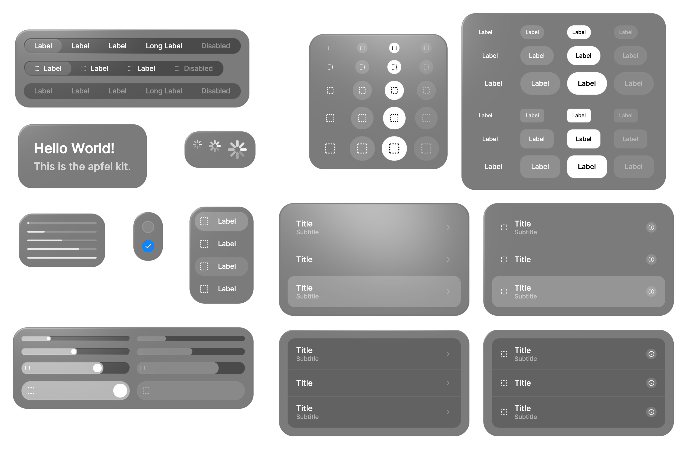

Build performant 3D user interfaces for **Three.js** using **@react-three/fiber** and **yoga** with support for nested scrolling, buttons, inputs, dropdowns, tabs, checkboxes, and more.

> Perfect for games, XR (VR/AR), and any web-based Spatial Computing App.

```bash
npm install three @react-three/fiber @react-three/uikit
```

### What does it look like ?

| A simple UI with 2 containers horizontally aligned, rendered in fullscreen. When the user hovers over a container, the container's opacity changes. |  |
| ---------------------------------------------------------------------------------------------------------------------- | ------------------------------------------------ |

```jsx
import { createRoot } from 'react-dom/client'
import React from 'react'
import { Canvas } from '@react-three/fiber'
import { Fullscreen, Container } from '@react-three/uikit'

createRoot(document.getElementById('root')).render(
  <Canvas>
    <Fullscreen flexDirection="row" padding={100} gap={100}>
      <Container flexGrow={1} backgroundOpacity={0.5} hover={{ backgroundOpacity: 1 }} backgroundColor="red" />
      <Container flexGrow={1} backgroundOpacity={0.5} hover={{ backgroundOpacity: 1 }} backgroundColor="blue" />
    </Fullscreen>
  </Canvas>,
)
```

## Pre-Styled Component Kits

We provide multiple kits containing **themable pre-styled components**. Inspired by shadcn, you can use our CLI to install the source code of any component to your desired loaction with one command.
> For example, to add the button from the default kit, run: `npx uikit component add default Button`

| <h3>default</h3> _based on [Shadcn](https://github.com/shadcn-ui/ui)_ | <h3>apfel</h3> _inspired by AVP_                            |
| --------------------------------------------------------------------- | ----------------------------------------------------------- |
|                                                                       |  |
| [View All Components](../kits/default.md)                             | [View All Components](../kits/apfel.md)                     |
| `npx uikit component add default Button`                                  | `npx uikit component add apfel Button`                          |

## How to get started?

> Some familiarity with
react, threejs, and @react-three/fiber, is recommended.

Get started with **[building your first layout](./first-layout.md)**, take a look at our **[examples](./examples.md)** to see uikit in action, or learn more about:

- [All components and their properties](./components-and-properties.md)
- [Interacitivity](../tutorials/interactivity.md)
- [Custom materials](../tutorials/custom-materials.md)
- [Custom fonts](../tutorials/custom-fonts.md)
- [Responsivene user interfaces](../tutorials/responsive.md)
- [Scrolling](../tutorials/scroll.md)
- [Sizing](../tutorials/sizing.md)
- [Common pitfalls](../advanced/pitfalls.md)
- [Optimize performance](../advanced/performance.md)
- [Theming components](../kits/theming.md)

## Migration Guides

- from [Koestlich](../migration/from-koestlich.md)
- from [HTML/CSS](../migration/from-html-css.md)
- from [Tailwind](../migration/from-tailwind.md)